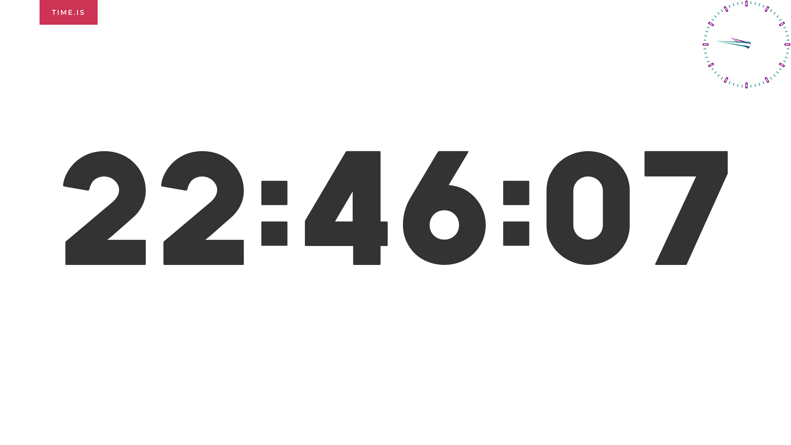

# Clock
A clock overlaying all windows including full-screened videos/games.

## Screenshots

The clock is shown in the upper-right.

## Functions
You can always show/hide the clock, furthermore, you can also smartly hide the clock whcih means that the clock will automatically appear when an application is fullscreen and hide when your task bar which has time information shows up.